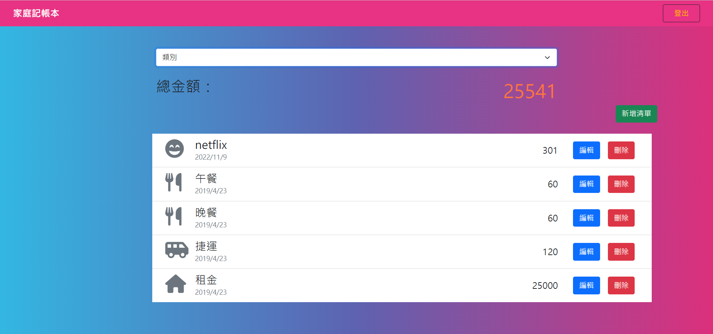

# Expense-Tracker

這是一個簡易的記帳本。  
使用者須先註冊，登入後可以進行新增、編輯、刪除支出，以及瀏覽各項支出等功能。  
目前提供篩選支出分類，在主畫面會顯示總金額。  
此應用程式亦發布於 Heroku，連結: https://expensetrackerwaylin.herokuapp.com/    
測試帳號: 名稱/email/密碼  
帳號 1:廣志/hiroshi@test.com/nh35  
帳號 2:小新/shin@test.com/ns05

---

## 專案畫面



---

## 環境建置與需求 (prerequisites)

- Node.js 14.16.0
- Express 4.18.1
- Express-handlebars 4.0.2
- Bootstrap 5.1.1
- Font-awesome 6.2.0
- Mongoose 5.9.7
- method-override 3.0.0
- bcryptjs 2.4.3
- connect-flash 0.1.1
- dotenv 8.2.0
- express-session 1.17.1
- passport 0.4.1
- passport-facebook 3.0.0
- passport-local 1.0.0
- moment 2.29.4

## 使用說明

1. 請先確認有安裝 node.js 與 npm
2. 透過終端機，Clone 此專案至本機電腦

   ```bash
   git clone https://github.com/linway035/restaurant.git
   ```

3. 透過終端機，cd 至存放的資料夾
4. 啟動伺服器，執行 app.js 檔案
   ```bash
    nodemon app.js
   ```
5. 成功連結後，開啟任一瀏覽器瀏覽器輸入 http://localhost:3000/ 開始使用
